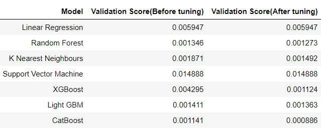
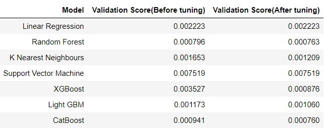

# Propulsion Plants Decay Evaluation

The gas turbine is the engine at the heart of the power plant that produces electric current. A gas turbine is a combustion engine that can convert natural gas or other liquid fuels to mechanical energy. This energy then drives a generator that produces electrical energy.

**This is a Machine Learning project on Gas Turbine Compressors and Turbine decay evaluation for Propulsion Plants.**

### Goal / Objective:

To build Machine learning models that can predict the GT Compressor decay state coefficient and GT Turbine decay state coefficient.

### Outcome: 

Achieved an RMSE(root-mean squared error) score of 0.000844 for our Compressor model and 0.000708 for our Turbine model.

## **File description:**

- ML model creation and evaluation(GT Compressor).ipynb: The Jupyter notebook where 7 different ML models were evaluated for the GT Compressor decay state coefficient.

- ML model creation and evaluation(GT Turbine).ipynb: The Jupyter notebook where 7 different ML models were evaluated for the GT Turbine decay state coefficient.

- GT_Compressor_model.py: Python file to recreate the model, i.e CatBoost(Best performing model with the lowest rmse score) for the Compressor decay state evaluation. 

- GT_Turbine_model.py: Python file to recreate the model, i.e CatBoost(Best performing model with the lowest rmse score) for the Turbine decay state evaluation. 

- CatBoostRegressor_GT_Compressor.pickle: Pickle file of the CatBoost model for Compressor

- CatBoostRegressor_GT_Turbine.pickle: Pickle file of the CatBoost model for Turbine

- scaler_GT_Compressor.pickle: Pickle file of the scaler object for the Compressor model

- scaler_GT_Turbine.pickle: Pickle file of the scaler object for the Turbine model

- Model_Comparison_GT_Compressor.csv: CSV file that contains the comparison chart of all the models tested for the Compressor decay state coefficient

- Model_Comparison_GT_Turbine.csv: CSV file that contains the comparison chart of all the models tested for the Turbine decay state coefficient.

## Resources:

**Python version :** 3.7
**Packages Used:** pandas, numpy, matplotlib, seaborn, sklearn, xgboost, lightgbm, catboost

## Machine Learning models tested:

Seven different Machine Learning models were used for this project.

- Linear regression

- Random Forest

- K Nearest neighbours

- Support vector machine

- XGBoost

- Light GBM(LGB)

- CatBoost

## <u>GT Compressor Decay State Evaluation</u>

### Model Comparison chart:

## <u>GT Turbine Decay State Evaluation</u>

### Model Comparison chart:

## Conclusion:

For both the cases, CatBoost model performs exceptionally well. It is fast, efficient and simple to implement as well.

